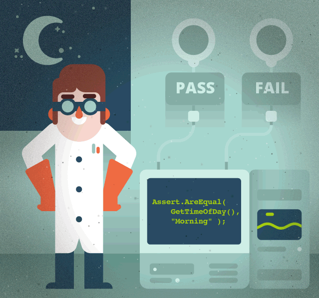
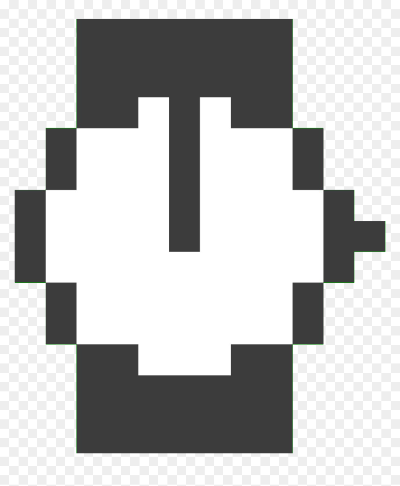

<p align="center"> 
        

 

 ## *Hi there* 

Welcome to the place where I share my automated tests and other useful things :rocket:

             
 

## ✨ **About Me**

 I am an experienced Software QA Engineer with strong test automation skills. Worked with various test automation tools.
 
 

<p align="right"> 
         
 

 
- 👨🏼‍💻 Tech Geek, always ready to learn new Technologies/Frameworks/Languages
- 🔭 &nbsp;I’m currently working on new collection of automated tests 
- 🌱 &nbsp;I’m currently learning and practicing TypeScript
- 🗂️ Some of my test collections are available in <a rel="me" href="https://github.com/Sanzhanov?tab=repositories">Alex's repositories</a>
- 💬 &nbsp;Ask me about anything related to QA Automation
- 📫 &nbsp;How to reach me: <a rel="me" href="https://www.linkedin.com/in/sanzhanov/">Alex Sanzhanov</a> or sanzhanov21@gmail.com

             
 

## 🛠️ **Languages and Tools** 
   

  
                 

             
 

## 📕 **My latest Posts**
- <a rel="last article" href="https://dev.to/sanzhanov/node-version-manager-nvm-how-to-install-and-use-step-by-step-guide-k4a">Node Version Manager (NVM): how to install and use (step-by-step guide)</a>
- <a rel="last article" href="https://dev.to/sanzhanov/run-api-tests-with-newman-and-send-reports-to-telegram-340e">Run API tests with Newman and send reports to Telegram</a>
- something interesting coming soon... :wink:

             
 

## 🔗 **My Profiles**
 

<a href="https://linkedin.com/in/sanzhanov" target="_blank">
<a href="https://dev.to/sanzhanov" target="_blank">
<a href="https://hackernoon.com/u/sanzhanov" target="_blank">

 
 

             
 

## 📝 **GitHub Stats** :octocat:
 

 

             
 

## 👨🏼‍💻 **Some of my latest projests**
 

| Project                                                              | Repository                                                                | Description                                                                           |
| ------------------------------------------------------------------------ | ------------------------------------------------------------------------- | --------------------------------------------------------------------------------- |
|  Newman-Telegram-API                        | [repository](https://github.com/Sanzhanov/Newman-Telegram-API)                        | Run your Test collections with Newman and get html-reports in Telegram                                               |
|  Newman-Run-Reporter-for-CRM-Project       | [repository](https://github.com/Sanzhanov/Newman-Collection-Run-Reporter-on-CRM-Project-example)       | Good example of automated running collections and getting HTML-reports                                  |
|  API-Automated-Tests-for-CRM-Project     | [repository](https://github.com/Sanzhanov/API-Automation-Tests-for-CRM-ClientBase-v5)       | The collection of more than 100 REST API Automated Tests for CRM Project                                  |
|  API-Automated-Tests-for-Payment-project     | [repository](https://github.com/Sanzhanov/API-Automation-Tests-for-Paysis-project)       | The collection of more than 60 REST API Automated Tests for Payment System Project (including mock server setup)                                  |
|  COVID-19-Countries-Reports-API     | [repository](https://github.com/Sanzhanov/COVID-19-Countries-Reports-API)       | The collection of automated tests for an open API Project                                  |
|  Postman-collection-for-CRM-Project     | [repository](https://github.com/Sanzhanov/Postman-full-collection-for-CRM-ClientBase-v5)       | Postman collection of more than 400 tests and scripts for CRM Project                        |

             
 

<p align="center"> 
   Visitors count:
   
    
 

 

 

<p align="center"> 
         
 

 
